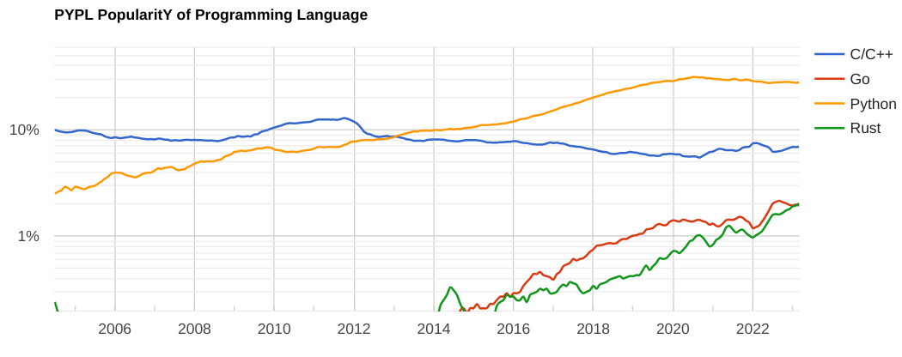

# Proactive Analytics - Technical interview

## General info about Go

Go is a statically typed, compiled programming language designed by Google in 2009. It was created to address the challenges of building large-scale networked systems and to provide a modern, efficient, and easy-to-use language for building software. Go code is known for its simplicity, readability, and scalability, and is used in a wide range of applications, from web servers to machine learning algorithms.

One of the key features of Go code is its support for concurrent programming, which allows multiple tasks to be executed simultaneously. This is achieved through goroutines, which are lightweight threads that allow for efficient use of system resources and make it easy to write concurrent programs.

Another important feature of Go code is its memory management system. Go uses a garbage collector to automatically manage memory allocation and deallocation, which eliminates the need for manual memory management and reduces the risk of memory-related errors.

Go code is also known for its performance. It is a compiled language, which means that code is translated into machine code before it is executed, resulting in faster execution times compared to interpreted languages. Additionally, Go's design prioritizes efficiency and simplicity, making it well-suited for high-performance applications.

## PROS AND CONS

### Pros

- Concurrent programming support (via goroutines).
- Efficient memory management: Go uses a garbage collector to manage memory allocation and deallocation, which reduces the risk of memory leaks and other memory-related errors.
- Simple syntax: Go has a simple syntax that is easy to read and write, making it a great language for beginners and experienced developers alike.
- High performance: Go's compiled nature and efficient design make it a high-performance language, which is important for large-scale applications and systems.
- Good standard library: Go has a strong standard library that provides many useful functions for developers, such as HTTP servers, networking, and cryptography.

### Cons

- Limited libraries: the number of third-party libraries available is relatively limited compared to other languages. This can make it more difficult to find and use specific tools or libraries.
- Statically typed. Note that generic types (or *generics*) function were added only recently (release v1.18).
- Steep learning curve for some concepts, such as channels and interfaces.
- No exceptions: Go does not have a built-in exception handling mechanism.
- Limited support for low-level programming: While Go is a low-level language, it does not offer the same level of control over hardware that other low-level languages, such as C or Assembly, do. This can be a limitation in certain contexts.

## Examples of use cases

### Best use cases

* Building scalable networked systems: Go's support for concurrent programming and efficient memory management make it well-suited for building large-scale networked systems, such as web servers, load balancers, and distributed systems.

* Developing command-line tools: Go's simple syntax and efficient performance make it a good choice for building command-line tools, such as utilities for system administration or data processing.

* Developing cloud-native applications: Go's simplicity, efficiency, and support for concurrent programming make it a good fit for developing cloud-native applications, such as microservices or serverless functions.

### Worse use cases

* Applications requiring extensive GUIs. Go GUI libraries are not as robust as those available in other languages like Java or Python.

* Go does not have built-in support for some data structures. For example, a set like Python. You need to implement those structures manually.

* Real-time systems: Go is not a real-time language, which means that it cannot guarantee that certain operations will be completed within a specific timeframe. Applications that require real-time capabilities may be better suited to other languages like C/C++.

## Comparison with other languages

 
